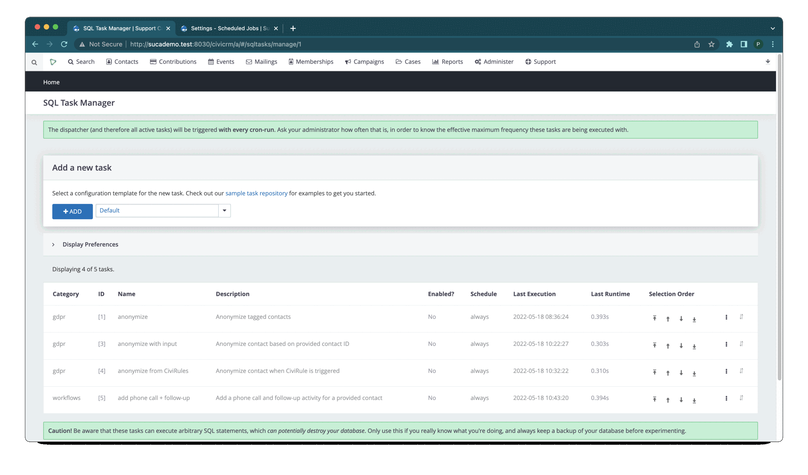

# SQL Tasks Extension

The SQL Tasks extension allows the execution of SQL-driven recurring tasks that
can perform actions like creating activities, calling arbitrary APIs and
synchronizing tags or groups. SQL Tasks is intended for power users who know
their way around SQL and are familiar with CiviCRM.
